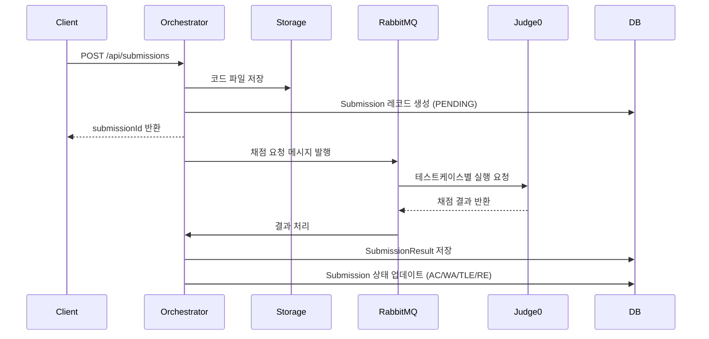

# CodeBrainer Backend API 문서

## 목차
- [개요](#개요)
- [데이터베이스 스키마](#데이터베이스-스키마)
- [API 엔드포인트](#api-엔드포인트)
- [데이터 모델](#데이터-모델)

---

## 개요

CodeBrainer의 백엔드는 **Spring Boot 3.3.5**와 **PostgreSQL**을 사용하며, 코딩 문제 관리 및 채점 시스템을 제공합니다.

### 기술 스택
- **Backend Framework**: Spring Boot 3.3.5, Java 21
- **ORM**: JPA/Hibernate + Flyway Migration
- **Database**: PostgreSQL 15
- **Message Queue**: RabbitMQ
- **Judge Engine**: Judge0 v1.13.1

### 서비스 포트
- **Orchestrator API**: `http://localhost:8080`
- **PostgreSQL**: `localhost:5432`
- **RabbitMQ**: `localhost:5672` (Management Console: `http://localhost:15672`)
- **Judge0**: `http://localhost:2358`

---

## 데이터베이스 스키마

### ERD 개요

```
problems (문제)
    ├── problem_tests (테스트케이스)
    ├── problem_hints (힌트)
    └── submissions (제출)
            └── submission_results (제출 결과)
```

### 1. `problems` 테이블

코딩 문제의 메타데이터를 저장합니다.

| 컬럼명 | 타입 | 제약조건 | 설명 |
|--------|------|----------|------|
| `id` | BIGSERIAL | PRIMARY KEY | 문제 고유 ID |
| `title` | VARCHAR(255) | NOT NULL | 문제 제목 |
| `slug` | VARCHAR(128) | UNIQUE, NOT NULL | URL 친화적 식별자 |
| `tier` | VARCHAR(32) | NOT NULL | 난이도 등급 (BRONZE, SILVER, GOLD, PLATINUM, DIAMOND) |
| `level` | INT | NOT NULL | 등급 내 난이도 레벨 (1-5) |
| `time_ms` | INT | NOT NULL | 시간 제한 (밀리초) |
| `mem_mb` | INT | NOT NULL | 메모리 제한 (MB) |
| `statement_path` | VARCHAR(255) | NOT NULL | 문제 설명 파일 경로 |
| `visibility` | VARCHAR(32) | NOT NULL | 공개 여부 (PUBLIC, PRIVATE) |
| `version` | INT | NOT NULL | 문제 버전 |
| `categories` | JSONB | - | 문제 카테고리 배열 (예: ["DP", "그리디"]) |
| `languages` | JSONB | - | 지원 언어 배열 (예: ["PYTHON", "JAVA"]) |
| `constraints` | TEXT | - | 제약 조건 설명 |
| `input_format` | TEXT | - | 입력 형식 설명 |
| `output_format` | TEXT | - | 출력 형식 설명 |
| `created_at` | TIMESTAMPTZ | DEFAULT NOW() | 생성 시각 |
| `updated_at` | TIMESTAMPTZ | DEFAULT NOW() | 수정 시각 |

**인덱스:**
- `uq_problems_slug` (UNIQUE) on `slug`

---

### 2. `problem_tests` 테이블

문제의 테스트케이스를 저장합니다.

| 컬럼명 | 타입 | 제약조건 | 설명 |
|--------|------|----------|------|
| `id` | BIGSERIAL | PRIMARY KEY | 테스트케이스 고유 ID |
| `problem_id` | BIGINT | FK → problems(id) ON DELETE CASCADE | 문제 ID |
| `case_no` | INT | NOT NULL | 테스트케이스 번호 |
| `in_path` | VARCHAR(255) | NOT NULL | 입력 파일 경로 |
| `out_path` | VARCHAR(255) | NOT NULL | 출력 파일 경로 |
| `is_hidden` | BOOLEAN | DEFAULT FALSE | 숨김 여부 (예제는 false) |
| `explanation` | TEXT | - | 테스트케이스 설명 |

**인덱스:**
- `idx_problem_tests_problem_case` on `(problem_id, case_no)`

---

### 3. `problem_hints` 테이블

문제 풀이 힌트를 단계별로 저장합니다.

| 컬럼명 | 타입 | 제약조건 | 설명 |
|--------|------|----------|------|
| `id` | BIGSERIAL | PRIMARY KEY | 힌트 고유 ID |
| `problem_id` | BIGINT | FK → problems(id) ON DELETE CASCADE | 문제 ID |
| `tier` | VARCHAR(16) | NOT NULL | 힌트 난이도 등급 |
| `stage` | SMALLINT | NOT NULL | 힌트 단계 (1, 2, 3...) |
| `title` | VARCHAR(200) | NOT NULL | 힌트 제목 |
| `content_md` | TEXT | NOT NULL | 힌트 내용 (Markdown) |
| `lang` | VARCHAR(8) | DEFAULT 'ko' | 언어 코드 |
| `is_active` | BOOLEAN | DEFAULT TRUE | 활성화 여부 |
| `version` | INT | DEFAULT 1 | 힌트 버전 |
| `source` | VARCHAR(32) | DEFAULT 'manual' | 힌트 출처 |
| `reviewer_id` | BIGINT | - | 검토자 ID |
| `wait_seconds` | INT | DEFAULT 0 | 힌트 오픈까지 대기 시간 (초) |
| `created_at` | TIMESTAMPTZ | DEFAULT NOW() | 생성 시각 |
| `updated_at` | TIMESTAMPTZ | DEFAULT NOW() | 수정 시각 |

**인덱스:**
- `uq_problem_hints_pid_stage_lang` (UNIQUE) on `(problem_id, stage, lang)`

---

### 4. `submissions` 테이블

사용자의 코드 제출 이력을 저장합니다.

| 컬럼명 | 타입 | 제약조건 | 설명 |
|--------|------|----------|------|
| `id` | BIGSERIAL | PRIMARY KEY | 제출 고유 ID |
| `user_id` | BIGINT | NOT NULL | 사용자 ID |
| `problem_id` | BIGINT | FK → problems(id) ON DELETE CASCADE | 문제 ID |
| `lang_id` | VARCHAR(32) | NOT NULL | 언어 식별자 (예: PYTHON, JAVA) |
| `code_path` | VARCHAR(512) | NOT NULL | 제출된 코드 파일 경로 |
| `status` | VARCHAR(32) | NOT NULL | 채점 상태 (PENDING, AC, WA, TLE, RE, CE) |
| `created_at` | TIMESTAMPTZ | DEFAULT NOW() | 제출 시각 |
| `updated_at` | TIMESTAMPTZ | DEFAULT NOW() | 수정 시각 |

**인덱스:**
- `idx_submissions_problem` on `problem_id`
- `idx_submissions_status` on `status`

**채점 상태 (status):**
- `PENDING`: 채점 대기 중
- `AC`: Accepted (정답)
- `WA`: Wrong Answer (오답)
- `TLE`: Time Limit Exceeded (시간 초과)
- `RE`: Runtime Error (런타임 에러)
- `CE`: Compile Error (컴파일 에러)

---

### 5. `submission_results` 테이블

제출의 채점 결과를 저장합니다.

| 컬럼명 | 타입 | 제약조건 | 설명 |
|--------|------|----------|------|
| `id` | BIGSERIAL | PRIMARY KEY | 결과 고유 ID |
| `submission_id` | BIGINT | FK → submissions(id) ON DELETE CASCADE | 제출 ID |
| `compile_ok` | BOOLEAN | NOT NULL | 컴파일 성공 여부 |
| `compile_msg` | TEXT | - | 컴파일 메시지/에러 |
| `summary_json` | JSONB | NOT NULL | 채점 결과 요약 (통과/전체 개수 등) |
| `tests_json` | JSONB | NOT NULL | 각 테스트케이스별 상세 결과 |

**인덱스:**
- `idx_submission_results_submission` (UNIQUE) on `submission_id`

**`summary_json` 예시:**
```json
{
  "passed": 8,
  "total": 10,
  "timeMs": 150,
  "memoryKb": 8192
}
```

**`tests_json` 예시:**
```json
[
  {
    "caseNo": 1,
    "verdict": "AC",
    "timeMs": 120,
    "memoryKb": 8000,
    "stderr": null
  },
  {
    "caseNo": 2,
    "verdict": "WA",
    "timeMs": 130,
    "memoryKb": 8100,
    "stderr": "AssertionError"
  }
]
```

---

## API 엔드포인트

### 1. 문제 조회 API (Public)

#### 1.1 문제 목록 조회

**요청:**
```http
GET /api/problems
GET ProblemListRequest
```

**응답:** `200 OK`
```json
[
  {
    "id": 1,
    "slug": "two-sum",
    "title": "Two Sum",
    "tier": "BRONZE",
    "level": 3,
    "categories": ["해시", "배열"],
    "languages": ["PYTHON", "JAVA", "CPP"],
    "statement": "두 수를 더해서 target을 만드는 인덱스를 반환하세요.",
    "createdAt": "2024-01-15T10:30:00Z",
    "updatedAt": "2024-01-15T10:30:00Z"
  }
]
```

---

#### 1.2 문제 상세 조회

**요청:**
```http
GET /api/problems/{slug}
GET ProblemRequest
```

**Path Parameters:**
- `slug` (String): 문제 슬러그 (예: `two-sum`)

**응답:** `200 OK`
```json
```ProblemResponse
{
  "id": 1,
  "slug": "two-sum",
  "title": "Two Sum",
  "tier": "BRONZE",
  "level": 3,
  "statement": "## 문제 설명\n두 수를 더해서...",
  "constraints": "- 1 ≤ nums.length ≤ 10^4\n- -10^9 ≤ nums[i] ≤ 10^9",
  "inputFormat": "첫 줄: 배열의 길이 n\n둘째 줄: n개의 정수",
  "outputFormat": "두 인덱스를 공백으로 구분하여 출력",
  "categories": ["해시", "배열"],
  "languages": ["PYTHON", "JAVA", "CPP"],
  "hints": [
    {
      "stage": 1,
      "title": "해시맵 사용 고려",
      "contentMd": "각 원소를 순회하면서...",
      "waitSeconds": 300
    }
  ],
  "testcases": [
    {
      "id": 101,
      "caseNo": 1,
      "input": "4\n2 7 11 15",
      "output": "0 1",
      "hidden": false,
      "explanation": "2 + 7 = 9"
    }
  ],
  "samples": [
    {
      "id": 101,
      "caseNo": 1,
      "input": "4\n2 7 11 15",
      "output": "0 1",
      "hidden": false,
      "explanation": "2 + 7 = 9"
    }
  ],
  "createdAt": "2024-01-15T10:30:00Z",
  "updatedAt": "2024-01-15T10:30:00Z"
}
```

**에러 응답:**
- `404 Not Found`: 문제를 찾을 수 없음

---

### 2. 제출 API (Public)

#### 2.1 코드 제출

**요청:**
```http
POST /api/submissions
Content-Type: application/json

{
  "problemId": 1,
  "langId": "PYTHON",
  "code": "def solution(nums, target):\n    # your code here\n    pass"
}
```

**Request Body:**
| 필드 | 타입 | 필수 | 설명 |
|------|------|------|------|
| `problemId` | Long | ✅ | 문제 ID |
| `langId` | String | ✅ | 언어 코드 (PYTHON, JAVA, CPP, C, JAVASCRIPT, GO) |
| `code` | String | ✅ | 제출할 소스 코드 |

**응답:** `200 OK`
```json
{
  "submissionId": 1001,
  "status": "PENDING"
}
```

**에러 응답:**
- `400 Bad Request`: 필수 필드 누락 또는 유효하지 않은 데이터
- `404 Not Found`: 문제를 찾을 수 없음

---

#### 2.2 제출 결과 조회

**요청:**
```http
GET /api/submissions/{submissionId}
```

**Path Parameters:**
- `submissionId` (Long): 제출 ID

**응답:** `200 OK`

**채점 대기 중:**
```json
{
  "submissionId": 1001,
  "status": "PENDING",
  "result": null
}
```

**채점 완료 (정답):**
```json
{
  "submissionId": 1001,
  "status": "AC",
  "result": {
    "compile": {
      "ok": true,
      "message": null
    },
    "summary": {
      "passed": 10,
      "total": 10,
      "timeMs": 150,
      "memoryKb": 8192
    },
    "tests": [
      {
        "caseNo": 1,
        "verdict": "AC",
        "timeMs": 120,
        "memoryKb": 8000,
        "stderr": null
      }
    ]
  }
}
```

**채점 완료 (오답):**
```json
{
  "submissionId": 1002,
  "status": "WA",
  "result": {
    "compile": {
      "ok": true,
      "message": null
    },
    "summary": {
      "passed": 8,
      "total": 10,
      "timeMs": 145,
      "memoryKb": 8100
    },
    "tests": [
      {
        "caseNo": 1,
        "verdict": "AC",
        "timeMs": 120,
        "memoryKb": 8000,
        "stderr": null
      },
      {
        "caseNo": 2,
        "verdict": "WA",
        "timeMs": 130,
        "memoryKb": 8100,
        "stderr": null
      }
    ]
  }
}
```

**컴파일 에러:**
```json
{
  "submissionId": 1003,
  "status": "CE",
  "result": {
    "compile": {
      "ok": false,
      "message": "SyntaxError: invalid syntax at line 5"
    },
    "summary": null,
    "tests": []
  }
}
```

**에러 응답:**
- `404 Not Found`: 제출을 찾을 수 없음

---

### 3. 문제 관리 API (Internal)

⚠️ **관리자 전용 API** - 내부 시스템에서만 접근 가능

#### 3.1 문제 생성/수정

**요청:**
```http
POST /internal/problems
Content-Type: application/json

{
  "title": "Two Sum",
  "slug": "two-sum",
  "tier": "BRONZE",
  "level": 3,
  "timeMs": 2000,
  "memMb": 256,
  "visibility": "PUBLIC",
  "version": 1,
  "categories": ["해시", "배열"],
  "languages": ["PYTHON", "JAVA", "CPP"],
  "constraints": "- 1 ≤ nums.length ≤ 10^4",
  "inputFormat": "첫 줄: 배열의 길이 n",
  "outputFormat": "두 인덱스를 공백으로 구분",
  "statement": "## 문제 설명\n...",
  "tests": [
    {
      "caseNo": 1,
      "input": "4\n2 7 11 15",
      "output": "0 1",
      "hidden": false,
      "explanation": "2 + 7 = 9"
    }
  ],
  "hints": [
    {
      "stage": 1,
      "title": "해시맵 사용",
      "contentMd": "해시맵을 활용하면...",
      "waitSeconds": 300
    }
  ]
}
```

**Request Body:**
| 필드 | 타입 | 필수 | 설명 |
|------|------|------|------|
| `title` | String | ✅ | 문제 제목 |
| `slug` | String | ✅ | URL 식별자 (고유) |
| `tier` | String | ✅ | 난이도 등급 |
| `level` | Integer | ✅ | 등급 내 레벨 (1-5) |
| `timeMs` | Integer | ✅ | 시간 제한 (밀리초) |
| `memMb` | Integer | ✅ | 메모리 제한 (MB) |
| `visibility` | String | ✅ | PUBLIC 또는 PRIVATE |
| `version` | Integer | ✅ | 문제 버전 |
| `categories` | String[] | ✅ | 카테고리 배열 |
| `languages` | String[] | ✅ | 지원 언어 배열 |
| `constraints` | String | ❌ | 제약 조건 |
| `inputFormat` | String | ❌ | 입력 형식 |
| `outputFormat` | String | ❌ | 출력 형식 |
| `statement` | String | ✅ | 문제 설명 (Markdown) |
| `tests` | ProblemTestDto[] | ❌ | 테스트케이스 배열 |
| `hints` | ProblemHintDto[] | ❌ | 힌트 배열 |

**응답:** `200 OK`
```json
1
```
(생성/수정된 문제의 ID)

**에러 응답:**
- `400 Bad Request`: 필수 필드 누락 또는 유효하지 않은 데이터
- `409 Conflict`: 동일한 slug를 가진 문제가 이미 존재 (신규 생성 시)

---

## 데이터 모델

### 지원 언어

| 코드 | 언어 | Judge0 Language ID |
|------|------|--------------------|
| `C` | C (GCC 9.2.0) | 50 |
| `CPP` | C++ (GCC 9.2.0) | 54 |
| `JAVA` | Java (OpenJDK 13.0.1) | 62 |
| `PYTHON` | Python 3.8.1 | 71 |
| `JAVASCRIPT` | JavaScript (Node.js 12.14.0) | 63 |
| `GO` | Go 1.13.5 | 60 |

### 난이도 등급

| Tier | Level | 설명 |
|------|-------|------|
| `BRONZE` | 1-5 | 기초 문제 |
| `SILVER` | 1-5 | 중급 문제 |
| `GOLD` | 1-5 | 중고급 문제 |
| `PLATINUM` | 1-5 | 고급 문제 |
| `DIAMOND` | 1-5 | 최고난이도 문제 |

### 채점 제한

현재 Judge0 설정:
- **CPU 시간**: 최대 15초
- **Wall 시간**: 최대 30초
- **메모리**: 최대 512MB
- **파일 크기**: 최대 1MB

---

## 채점 프로세스

### 1. 제출 플로우



### 2. 채점 결과 폴링

클라이언트는 제출 후 `GET /api/submissions/{submissionId}`를 주기적으로 호출하여 상태를 확인합니다.

**권장 폴링 간격:**
- 첫 5초: 500ms 간격
- 5초~30초: 1초 간격
- 30초 이후: 2초 간격
- 최대 2분 후 타임아웃

---

## 환경 변수

### `application.yml` 주요 설정

```yaml
spring:
  datasource:
    url: jdbc:postgresql://localhost:5432/codebrainer
    username: postgres
    password: postgres

judge0:
  base-url: http://localhost:2358

storage:
  base-path: /var/codebrainer/storage

rabbitmq:
  host: localhost
  port: 5672
  username: guest
  password: guest
```

---

## 에러 처리

### 공통 에러 응답 형식

```json
{
  "timestamp": "2024-01-15T10:30:00Z",
  "status": 400,
  "error": "Bad Request",
  "message": "problemId는 필수입니다.",
  "path": "/api/submissions"
}
```

### HTTP 상태 코드

| 코드 | 의미 | 설명 |
|------|------|------|
| `200 OK` | 성공 | 요청 성공 |
| `201 Created` | 생성됨 | 리소스 생성 성공 |
| `400 Bad Request` | 잘못된 요청 | 필수 필드 누락 또는 유효하지 않은 데이터 |
| `404 Not Found` | 찾을 수 없음 | 리소스가 존재하지 않음 |
| `409 Conflict` | 충돌 | 중복된 리소스 |
| `500 Internal Server Error` | 서버 오류 | 서버 내부 오류 |

---

## 개발 팁

### 1. 로컬 데이터베이스 접근

```bash
# PostgreSQL 컨테이너 접속
docker exec -it backend-postgres-1 psql -U postgres -d codebrainer

# 문제 목록 조회
SELECT id, title, slug, tier, level FROM problems;

# 제출 상태 확인
SELECT id, problem_id, status, created_at FROM submissions ORDER BY created_at DESC LIMIT 10;
```

### 2. API 테스트 (curl)

```bash
# 문제 목록 조회
curl http://localhost:8080/api/problems

# 문제 상세 조회
curl http://localhost:8080/api/problems/two-sum

# 코드 제출
curl -X POST http://localhost:8080/api/submissions \
  -H "Content-Type: application/json" \
  -d '{
    "problemId": 1,
    "langId": "PYTHON",
    "code": "def solution():\n    pass"
  }'

# 제출 결과 조회
curl http://localhost:8080/api/submissions/1001
```

### 3. RabbitMQ Management Console

브라우저에서 `http://localhost:15672` 접속
- Username: `guest`
- Password: `guest`

채점 큐 상태 및 메시지를 모니터링할 수 있습니다.

---

## 참고 자료

- [BUILD_INSTRUCTIONS.md](./BUILD_INSTRUCTIONS.md) - 프로젝트 빌드 및 실행 가이드
- [JUDGE0_SETUP.md](./JUDGE0_SETUP.md) - Judge0 채점 시스템 설정
- [Spring Boot 공식 문서](https://spring.io/projects/spring-boot)
- [Judge0 API 문서](https://ce.judge0.com/)

